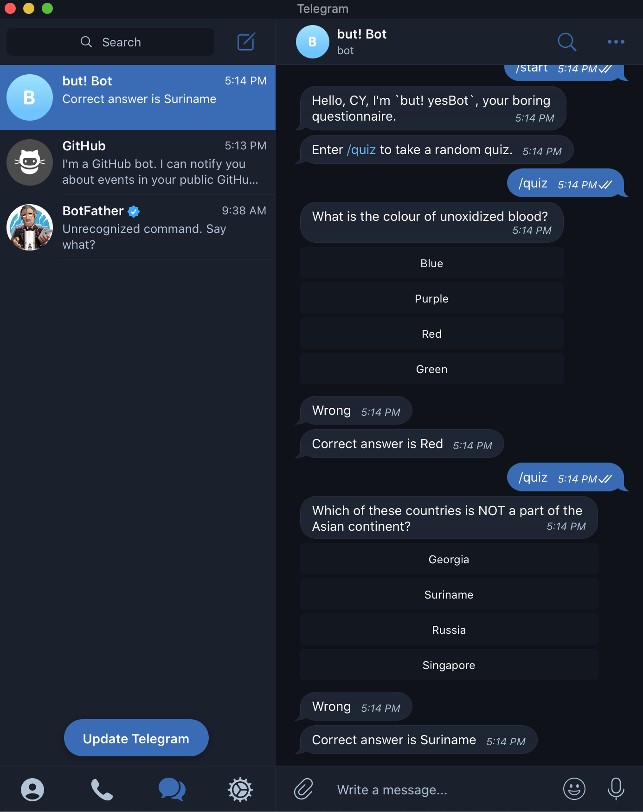

 

# About YesBot

This project is a telegram bot that interacts with users. The bot `YesBot` acts as a friendly questionnaire that engages users in series of quiz of very random questions.

My idea of this bot was to create a simple friendly and educative companion that helps users overcome boredom by sharing random knowledge.

## Built With

- Ruby programming language
- [telegram-bot-ruby](https://github.com/atipugin/telegram-bot-ruby)
- [Open Trivia Database API](https://opentdb.com)

## Getting Started

To get started you must have a Telegram account and a Telegram API token. To get an API token and also create a bot, log into your Telegram app, search for `BotFather`, initiate a chat with `BotFather` by clickng **"start"** or typing `/start`, then follow subsequent instructions. Learn more [here](https://core.telegram.org/bots#6-botfather)

- cd into your desired directory where you would like the project to live and run `git clone git@github.com:cyonii/yes-bot.git`
- run `cd yes-bot` to get into the project's directory you just cloned
- add your Telegram API to your environment variables named as `TELEGRAM_TOKEN` or hard code it into the `token` variable in `bin/main.rb` file as a string
- run `bundle install` to install the project's dependencies.
- run `bin/main.rb` to initiate bot to start listening.
- head over to your Telegram app, search for the bot you created by it's username or display name, enter `/start` to initiate interaction, follow subsequent instructions

## Tests

This project has been tested using `rspec`. To run test, cd into the project's directory and run `rspec` on your terminal.

## Available Commands

- /start - to start interaction with the bot
- /quiz - to get a random quiz

## Author

- GitHub: [@cyonii](https://github.com/cyonii)
- Twitter: [@theOnuoha](https://twitter.com/theOnuoha)
- LinkedIn: [Silas Kalu](https://www.linkedin.com/in/cyonii/)

## 🤝 Contributing

Contributions, issues, and feature requests are welcome!

Feel free to check the [issues page](issues/).

## Show your support

Give a ⭐️ if you like this project!

## Acknowledgments

- telegram-bot-ruby
- Open Trivia
- Microverse

## 📝 License

This project is [MIT](lic.url) licensed.
